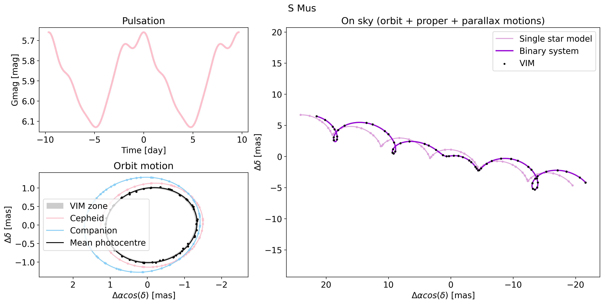

## Introduction

`simbinary` is a Python package to simulate Gaia epoch astrometry for binary systems, with a particular focus on Variable-Induced Mover (VIM) sources.

The package contains two main modules:

- `SimBinary`: simulation of Gaia epoch astrometric data  
- `fitGaia`: a shortcut to fit data using [kepmodel](https://gitlab.unige.ch/delisle/kepmodel)

## Installation

### Install directly from GitHub

```bash
pip install git+https://github.com/katsivkova/simbinary
```

### Install in editable mode (for development)

```
git clone https://github.com/katsivkova/simbinary 
cd simbinary
pip install -e .
```

## Example

A Jupyter notebook example is available in the `examples/` directory.



## Requirements

- [kepmodel](https://gitlab.unige.ch/delisle/kepmodel)
- [kepler.py](https://pypi.org/project/kepler.py/)